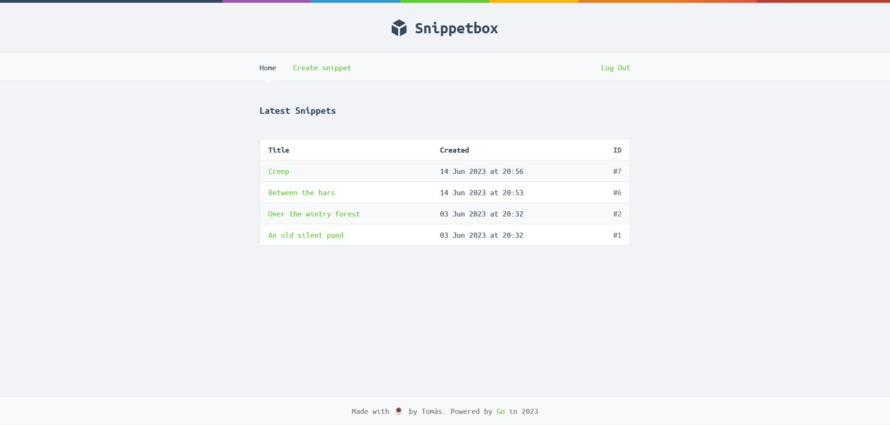

# Snippetbox

Web application that lets you save snippets of text.

## 📃 Features

- Save and view text snippets.
- User authentication.
- Middleware.
- RESTful routing.
- TLS web server (HTTPS).
- Leveled logging
- Data persistence using MySQL database.
- Dynamic HTML using Go templates.
- Session management.

## 🛠️ Setup

### Database

Start MySQL on the command line

```console
$ mysql -u root -p
Enter password:
mysql>
```

Run the SQL to create the database, tables and user (also availabe in snippetbox.sql)

```SQL
CREATE DATABASE snippetbox CHARACTER SET utf8mb4 COLLATE utf8mb4_unicode_ci;

USE snippetbox;

CREATE USER 'web'@'localhost';
GRANT SELECT, INSERT, UPDATE, DELETE ON snippetbox.* TO 'web'@'localhost';
-- Important: swap 'pass' with a password of your own choosing.
ALTER USER 'web'@'localhost' IDENTIFIED BY 'pass';

CREATE TABLE snippets (
    id INTEGER NOT NULL PRIMARY KEY AUTO_INCREMENT,
    title VARCHAR(100) NOT NULL,
    content TEXT NOT NULL,
    created DATETIME NOT NULL,
    expires DATETIME NOT NULL
);
CREATE INDEX idx_snippets_created ON snippets(created);

CREATE TABLE users (
    id INTEGER NOT NULL PRIMARY KEY AUTO_INCREMENT,
    name VARCHAR(255) NOT NULL,
    email VARCHAR(255) NOT NULL,
    hashed_password CHAR(60) NOT NULL,
    created DATETIME NOT NULL
);
ALTER TABLE users ADD CONSTRAINT users_uc_email UNIQUE (email);

CREATE TABLE sessions (
    token CHAR(43) PRIMARY KEY,
    data BLOB NOT NULL,
    expiry TIMESTAMP(6) NOT NULL
);
CREATE INDEX sessions_expiry_idx ON sessions (expiry);
```

### Run the application

Make sure to change "pass" with the password that you chose on the previous step

```go
go run ./cmd/web -dsn="web:pass@/snippetbox?parseTime=true"
```

by default the app runs on port :4000, but you can specify a different one with the `addr` command line argument

```go
go run ./cmd/web -addr=":3000" -dsn="web:pass@/snippetbox?parseTime=true"
```
